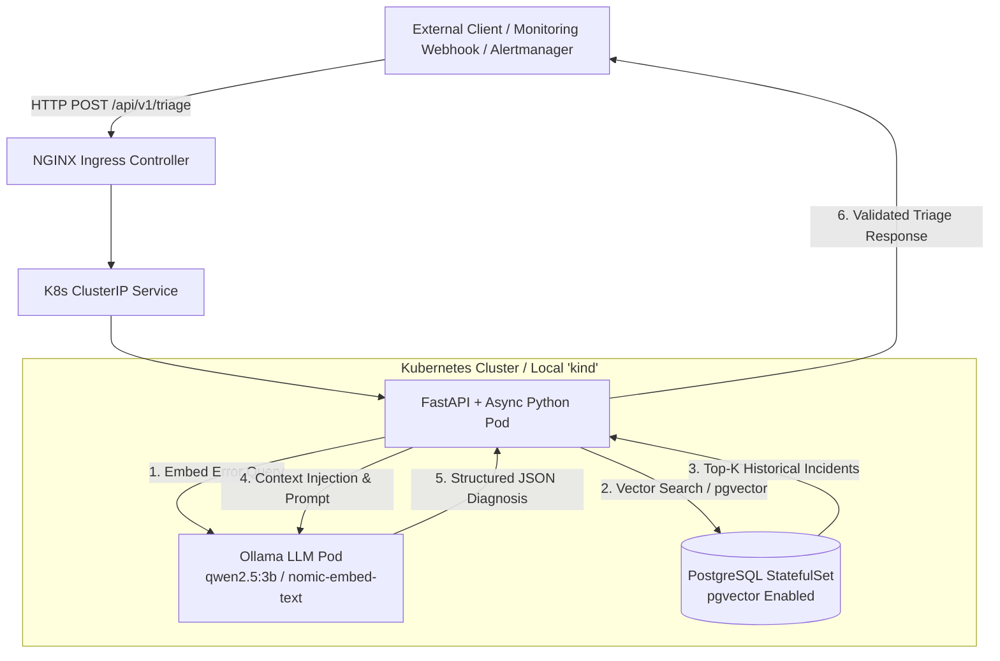

# AI-Powered Kubernetes Log Triage & Anomaly Service (`k8s-ai-log-triage`)

An enterprise-grade, cloud-native microservice built with **FastAPI**, **PostgreSQL (`pgvector`)**, **Ollama**, and **Kubernetes**.

The system provides an automated **AIOps Incident Engine** that ingests application and cluster error logs, executes vector similarity searches against historical incident resolutions in PostgreSQL, and leverages a local open-weight LLM (`qwen2.5`) to generate structured root-cause diagnoses, remediation steps, and executable `kubectl` diagnostic commands.

---

## Core Objectives & Workflow

* **Automated Log Ingestion & RAG Triage:** Ingests live error logs (manually via API or automatically via webhooks/log forwarders like Fluentbit or Alertmanager) and converts error messages into 768-dimensional embeddings using `nomic-embed-text`.
* **Context-Grounded Analysis (`pgvector`):** Performs cosine similarity searches (`<=>`) against a historical knowledge base of resolved incidents to supply real operational context, preventing LLM hallucinations.
* **Structured AI Diagnoses:** Leverages `qwen2.5:3b` via Ollama to produce strict JSON responses containing root cause analysis, confidence scores, human-readable remediation steps, and copy-pasteable `kubectl` commands.
* **Zero-Cloud-Cost Local Kubernetes & IaC:** Fully runnable locally using **Kubernetes in Docker (`kind`)** and local Terraform/Docker providers with zero cloud subscription costs, while maintaining cloud-agnostic deployment patterns suitable for **Azure Kubernetes Service (AKS)** or other managed Kubernetes platforms.

---

## System Architecture



---

## Local Development & Testing

When running or testing the application locally outside the Kubernetes cluster, ensure your `.env` or local configuration points to port `5433` to route through your local port-forwarding bridge.

### 1. Active Port Forwarding
Open a dedicated terminal and bridge the cluster database to your local machine:
```powershell
kubectl port-forward svc/postgres-service 5433:5432 -n ai-log-triage
```

### 2. Seed the Vector Database
Populate the incident_logs table with baseline error embeddings and sample records:
```powershell
uv run python -m app.services.vector_service
```

### 3. Run the Test Suite
Execute unit and integration tests locally:
```powershell
uv run pytest
```
*(Note: Port forwarding must remain active during integration tests that query the vector database).*
